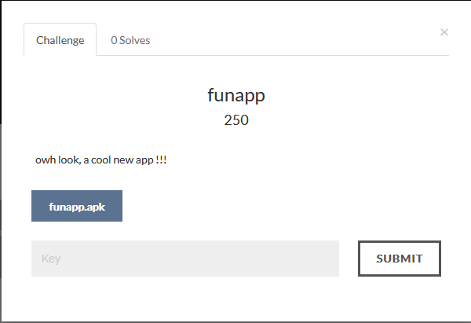
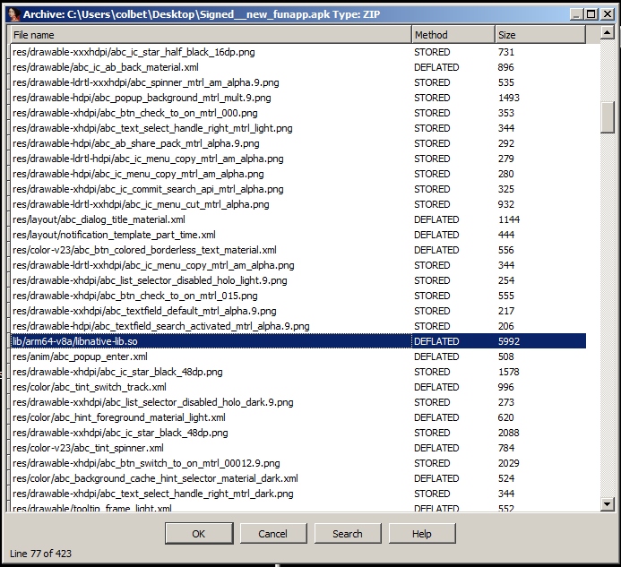
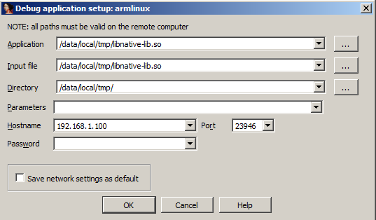
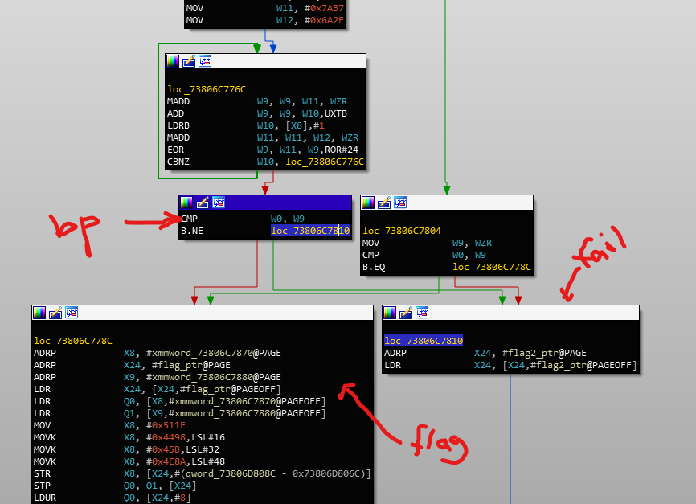
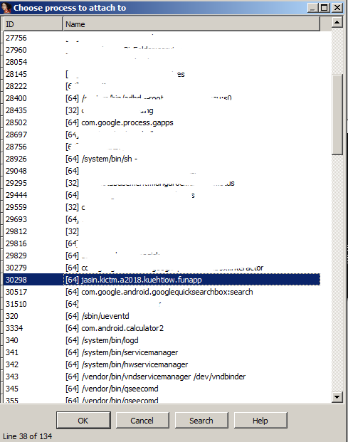
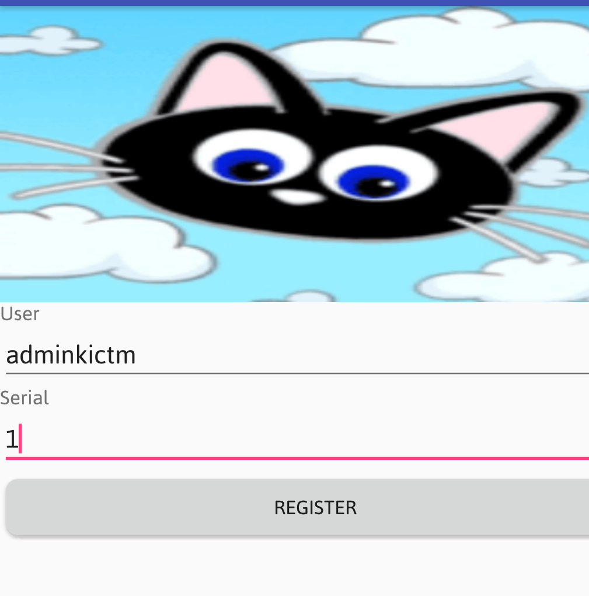
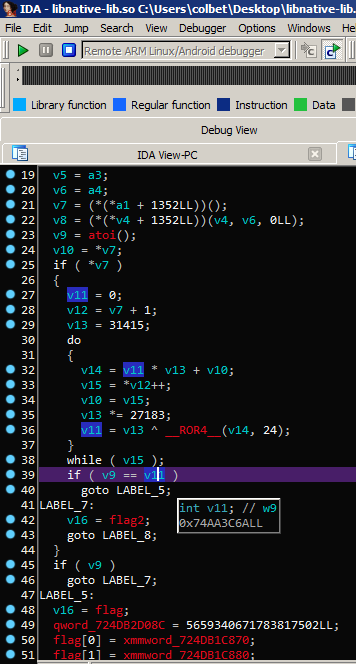
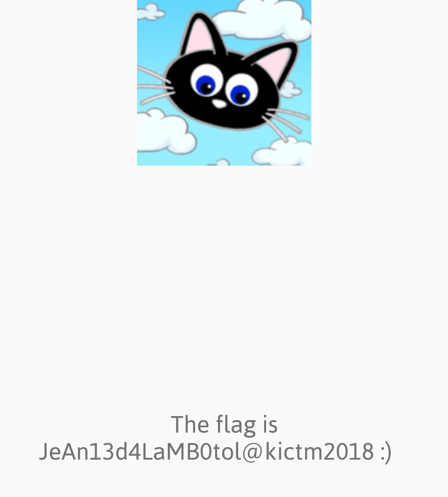

## funapp.apk

**Category:** Binary

**Points:** 250

**Solves:** 0

**Description:**



They told us that username for the app is `adminkictm`
### Write-up

This is an android challenge with with shared object (.so) as serial checker for username `adminkictm`

because i never debug android shared library before, so it give me hard time to setup the proper debugging environment. Here  to setup the environment (android+ida).Why ida? because GUI has spoilt me :P so this writeup just focusing on debugging the challenge using ida.

After decompile + add enable debugging + compile + resign apk

we can proceed to debug it
open apk with ida and select the highlighted .so as shown below


select `ARMLinux/Android debugger`

go to Debugger > Process Options and set as below

The IP is your android device IP



on your devices, make sure android debugging is enable
on your pc open cmd and push `android_server64` to devices and make sure the app already installed

```cmd
C:\>adb push android_server64 /data/local/tmp/
C:\>adb shell
android-devices:/ $ cd /data/local/tmp/
android-devices:/data/local/tmp $ ls
android_server64
android-devices:/data/local/tmp $ su
android-devices:/data/local/tmp # ./android_server64
IDA Android 64-bit remote debug server(ST) v1.22. Hex-Rays (c) 2004-2017
Listening on 0.0.0.0:23946...
```

run the fun app on android devices

set breakpoint at `Java_jasin_kictm_a2018_kuehtiow_funapp_MainActivity_semakSerial` function

the `CMP W0,W9` is our key comparison to decode the flag, if our input is the same as key, it will decode the flag otherwise it fill fail.



now on back to ida go to Debugger > Attach to process



if there is popup `Debugger warning` just click `same`
click run on ida and add our username and dummy serial at devices and click register





here is our checker, `v9 = 1` which is our input while `v11 = 74AA3C6A` is the correct serial

we need to convert it from hex to decimal to get the `serial = 1957313642`



Flag : JeAn13d4LaMB0tol@kictm2018