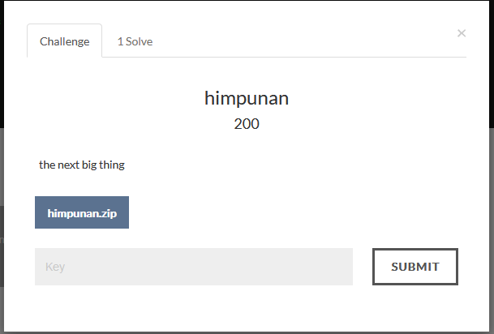
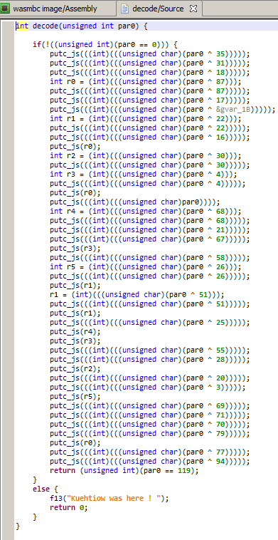

## himpunan

**Category:** web

**Points:** 200

**Solves:** 0

**Description:**




### Write-up

Webassembly challenge.
I just load into jeb decompiler the `main.wasm` file and decompile the decode function



construct it back in python
```python
par0 = 119
flag = ''

flag = chr(par0 ^ 35)
flag += chr(par0 ^ 31)
flag += chr(par0 ^ 18)
r0 = chr(par0 ^ 87)
flag += chr(par0 ^ 87)
flag += chr(par0 ^ 17)
flag += chr(par0 ^ 0x1b)
r1 = chr(par0 ^ 22)
flag += chr(par0 ^ 22)
flag += chr(par0 ^ 16)
flag += r0
r2 = chr(par0 ^ 30)
flag += chr(par0 ^ 30)
r3 = chr(par0 ^ 4)
flag += chr(par0 ^ 4)
flag += r0
flag += chr(par0)
r4 = chr(par0 ^ 68)
flag += chr(par0 ^ 68)
flag += chr(par0 ^ 21)
flag += chr(par0 ^ 67)
flag += r3
flag += chr(par0 ^ 58)
r5 = chr(par0 ^ 26)
flag += chr(par0 ^ 26)
flag += r1
r1 = chr(par0 ^ 51)
flag += r1
flag += chr(par0 ^ 25)
flag += r4
flag += r3
flag += chr(par0 ^ 55)
flag += chr(par0 ^ 28)
flag += r2
flag += chr(par0 ^ 20)
flag += chr(par0 ^ 3)
flag += r5
flag += chr(par0 ^ 69)
flag += chr(par0 ^ 71)
flag += chr(par0 ^ 70)
flag += chr(par0 ^ 79)
flag += r0
flag += chr(par0 ^ 77)
flag += chr(par0 ^ 94)

print flag
```

The flag is w3b4sMmaDn3s@kictm2018 :)