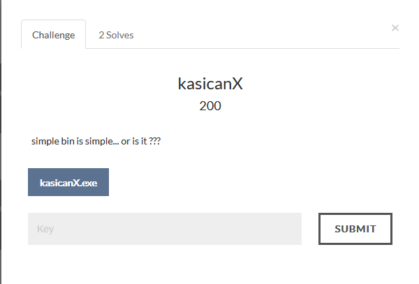
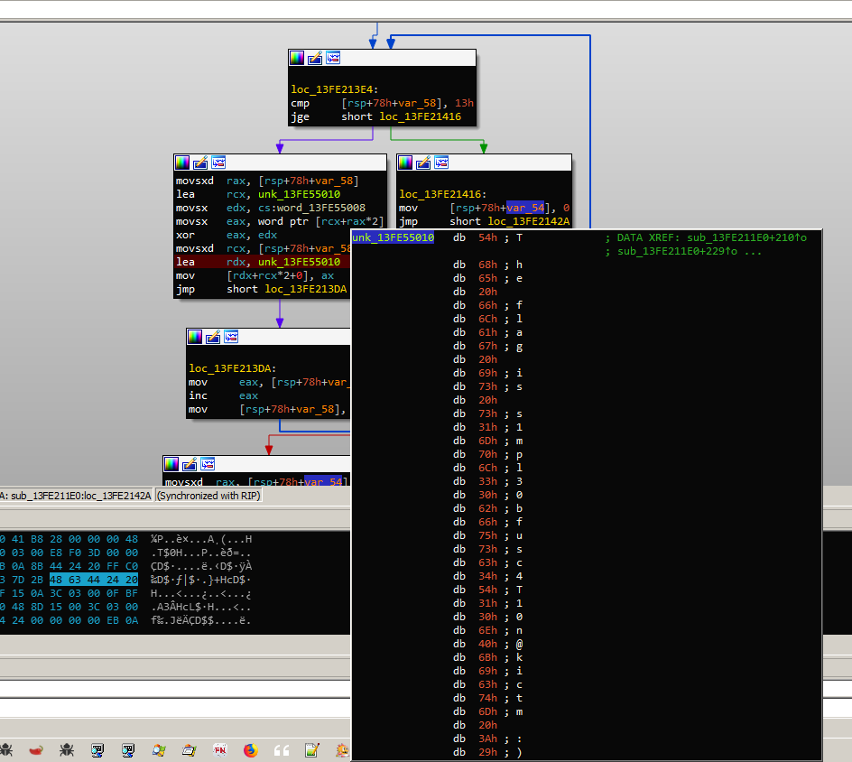

## kasicanX

**Category:** bin

**Points:** 200

**Solves:** -

**Description:** 

### Write-up

This binary actually identical to kasican.exe which is xor encryption but its just have a little obfuscation and compiled as 64bit PE.
because im lazy, i just load it in the debuggger find the part that have so many call and breakpoint at the flag check.

for reference

`key = 0xBACA`

`bytes = EE A2 DF EA DC A6 DB AD 9A A3 C9 EA C9 FB D7 BA D6 F9 8A A8 DC BF C9 A9 8E 9E 8B FA D4 8A D1 A3 D9 BE D7 EA 80 E3`

The flag is s1mpl30bfusc4T10n@kictm :)
